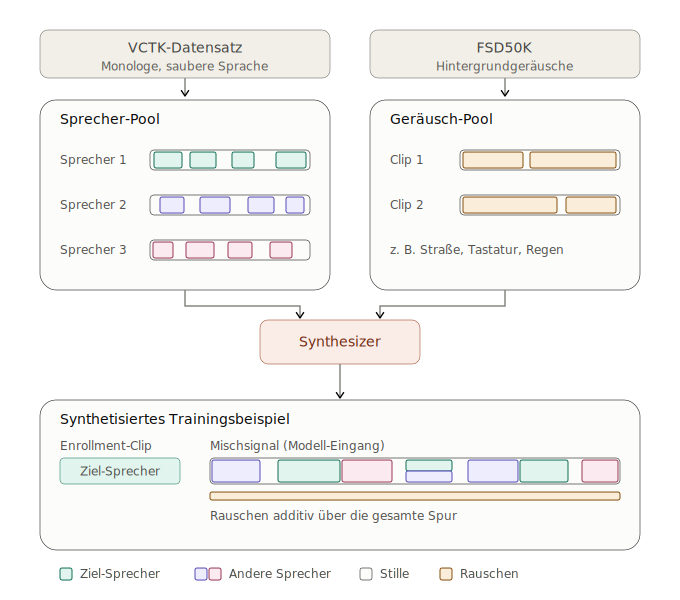
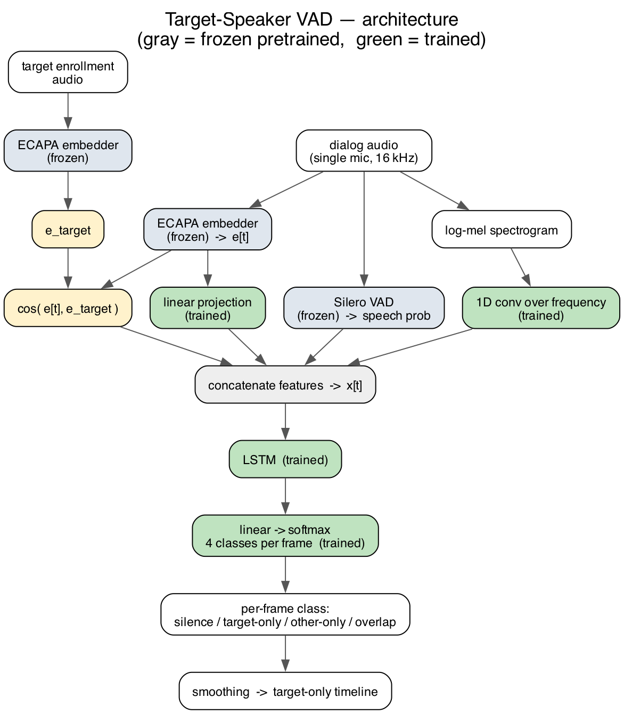

# Target-Person Voice — Personal VAD

Given a short **enrollment** clip of one target person, this project builds a detector
that listens to a **single-microphone dialog** (several people, overlaps, noise) and
outputs a **timeline of when the target is speaking alone**. Silence, other speakers,
and the target overlapping someone else all count as "not target". This is the task the
literature calls **Personal VAD / Target-Speaker Voice Activity Detection**.

See `ROADMAP.md` for the full design rationale and decisions.

---
## Created Data Set 



## Model architecture

Only a **small head is trained**. The heavy pretrained models are frozen and used just
to turn audio into features (this keeps it runnable on a CPU / Apple Silicon).



*Gray = frozen pretrained nets, green = the trained head, yellow = per-frame features.*

**Frozen feature extractors** (run once, never trained):
- **Silero VAD** → speech probability per frame.
- **SpeechBrain ECAPA-TDNN** → a 192-d speaker embedding per short window.

**Per 10 ms frame, the head sees four things:**
| feature | what it is | why |
|---|---|---|
| `logmel` (40) | mel spectrogram of the frame | energy/harmonics → tells overlap from single speaker |
| `emb` (192) | ECAPA speaker embedding | who is speaking |
| `cos` (1) | cosine similarity of `emb` to the enrollment embedding `e_target` | *is this the target?* — handed to the model directly |
| `vad` (1) | Silero speech probability | speech vs silence |

**The trained head:**
```
logmel (40) ──1D Conv over frequency (2 layers, per-frame)──▶ m (64)
emb   (192) ──Linear + ReLU────────────────────────────────▶ e (32)
cos, vad                                                    ─▶ (2)
        x = [ m , e , cos , vad ]   (98 per frame)
        x ──▶ LSTM (hidden 64, causal) ──▶ Linear ──▶ 4-class softmax per frame
```
The four classes are **{silence, target-only, other-only, overlap}**; "record" =
`target-only`. A post-processing smoothing step turns the per-frame labels into clean
target-only segments (the timeline).

The mel Conv1d runs **over frequency within a single frame** (no time mixing), so the
same code works offline and streaming — the LSTM does all the temporal reasoning.

## How the data is built

Real labelled overlap data is scarce, so scenes are **synthesized** and every 10 ms
frame gets a label for free. Everything is **seeded and deterministic** — a seed fully
reproduces a scene.

- **Sources:** VCTK (109 clean speakers) resampled to 16 kHz mono; FSD50K for noise.
- **Speaker-disjoint splits** (~80 / 14 / 15). Test speakers never appear in training,
  so we measure generalization, not memorization.
- **Per scene:** pick 1 target + 1–3 interferers from the same split; energy-trim each
  utterance; lay them on one timeline with gaps, natural turn-taking and deliberate
  **overlaps**; label each frame 4-class from who is actually active.
- **Enrollment** uses *different* recordings of the target (no audio reuse → no leakage),
  averaged into a single `e_target` vector.
- **Loudness (TIR):** per scene the interferer is scaled to a two-sided ratio
  (−12…+12 dB) so the model can't cheat with "loudest = target".
- **Noise:** an FSD50K background bed mixed in at **+5…+20 dB SNR** using held-out noise
  files (so we never test on noise seen in training).

## Results (val set, speaker-disjoint)

Headline = frame-level **F1 for the `target-only` class** (never bare accuracy —
silence dominates the frames).

| model | trained on | tested on | target-only F1 |
|---|---|---|---|
| cosine-threshold baseline | — | clean | 0.702 |
| LSTM head | clean | clean | **0.844** |
| LSTM head | clean | noisy | 0.716 |
| LSTM head | noisy | noisy | 0.787 |
| LSTM head | noisy | clean | 0.784 |

The trained head clearly beats the non-learned baseline, and training with noise makes
it far more stable across clean/noisy conditions (the noise-trained model scores
0.787 / 0.784 on noisy / clean, vs the clean-trained model collapsing to 0.716 on
noise). `overlap` is still the weakest class (F1 ≈ 0.3) and is the main open problem.

### Ablation — bidirectionality (LSTM vs BiLSTM)

Same features and training; only the LSTM direction changes (clean, target-only F1):

| architecture | clean→clean F1 | note |
|---|---|---|
| **unidirectional LSTM** (primary) | 0.844 | causal → the *same* model works for streaming (Phase 7) |
| BiLSTM | 0.863 | uses future frames → offline only |

Bidirectionality buys only a small offline gain here (~0.02 under matched training; a
noisier learning-curve sweep put it higher). With just 20 val scenes that gap isn't
reliably measurable, so we treat the two as close. We pick the **unidirectional LSTM as
the primary model** because it is *causal* — the identical architecture runs in the
Phase-7 streaming setting — at little or no accuracy cost. The BiLSTM stays as an
offline upper-bound reference (`data/models/personal_vad_bilstm.pt`).

### Ablation — hard VAD gate (why VAD is a *feature*, not a filter)

A natural alternative architecture is a **cascade**: filter the dialog through Silero
first (frames below the speech threshold are declared silence outright) and run a
3-class head {target-only, other-only, overlap} on the surviving speech frames only.
We built and trained it (noisy data, gate at 0.5):

| architecture | target-only F1 (noisy) |
|---|---|
| VAD as soft input feature (ours) | **0.787** |
| hard VAD gate → 3-class head | 0.688 |
| cosine-threshold baseline | 0.700 |

The cascade lost — below even the non-learned baseline — and the reason is measurable
before training: at threshold 0.5 Silero passes only ~65% of true target-only frames,
so every gate-rejected target frame is an unrecoverable miss and the cascade's F1 is
*capped* at ~0.79 even with a perfect head. Feeding the VAD score as one input among
four instead lets the LSTM overrule VAD mistakes using the mel and embedding evidence
(the trained model's miss rate is 0.096 vs the cascade's 0.396). This is why the
architecture treats every frozen output as evidence for the head, never as a hard
pre-filter.

## AI usage

I (the author) **designed the model architecture and the data-synthesis scheme** — the
4-class formulation, the frozen-backbone + small-head split, the feature set
(embedding + cosine-to-enrollment + mel + VAD), and how scenes are generated (speaker-
disjoint splits, two-sided TIR, overlap labelling, noise mixing).

I then let the **AI build essentially all of the implementation**. Along the way I
broadly reviewed what it produced, and where I spotted **misunderstandings** I pointed
them out for the AI to fix. So the design decisions are mine; the code is AI-written
under my review. (This is also a learning project — the AI writes reference `*_example`
files, and I re-implement the real source by hand while studying them.)
